# Technobabble Technology Blog  
  by Bradley Moleterno    
## Description
Have you ever wanted to sound more intelligent? One way to present yourself as a highly sophisticated, intelligent person is to have a decent working vocabulary and technical knowledge. But learning actual technical ideas can be difficult.  

An easier way is to develop technobabble.  Technobabble is a type of jargon that consists of mostly of buzzwords, esoteric language, or technical jargon. It is mostly nonsense but may rarely contain actual   real information. But man, it sure makes you sound like you know what you are talking about.  

Technobabble Technology Blog is a blog where users can post their short pieces of technobabble. A user may make a post, edit it or delete it if necessary. Other users may read the posts and make comments if they wish. With Technobabble Technology Blog, you will be on your way to presenting yourself as a smarter person. Even if it is only an illusion. 
## Deployed Application URL
https://doggy-5a7274df051c.herokuapp.com
## Table of Contents
* [Installation](#installation)
* [How to Use This Application](#how-to-use-this-application)
* [Licenses](#Licenses)
* [Contributors](#contributors)
* [Testing](#testing)
* [Features](#features)
* [Languages and Technologies Used](#languages-and-technologies-used)
* [Dependencies](#dependencies)
* [Questions](#questions)

## Installation
No installation is required. The application is run from the URL https://doggy-5a7274df051c.herokuapp.com/. To access the code for the application, please visit the repository located at https://github.com/Boilermaker74/Technobabble-Technology-Blog 
## How to Use This Application:
Click on the url here. https://doggy-5a7274df051c.herokuapp.com/. 

The application will open on the homepage, which includes any existing blog posts. 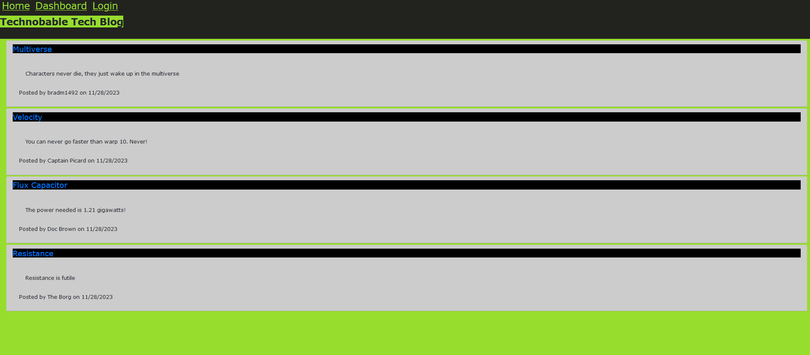  

To access the other screens of the application, the user must first sign in. Since the user has not created an account a username and password must be entered in the signup field.  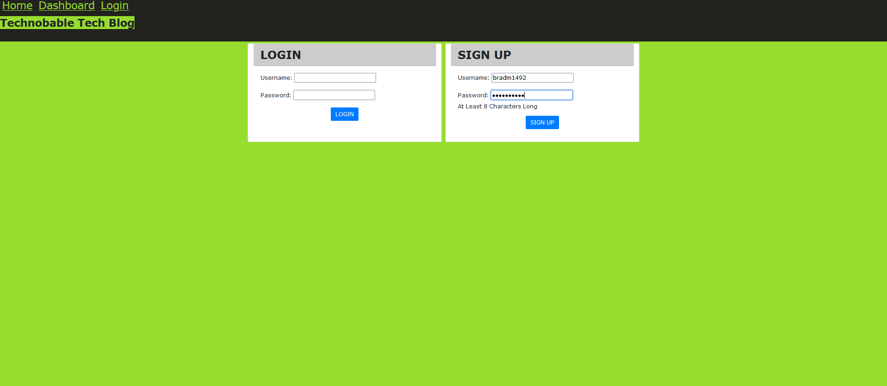   

Once a username and password have been created, the application immediately opens the user’s Dashboard. Since it's the first time the user has opened the dashboards, any posts that normally would be displayed are not displayed because none have been created yet. The username and password are retained in the application    

Clicking on homepage option in the navigation bar takes the user to the homepage. Here the user is presented with existing blog posts that include the post title and the date created.  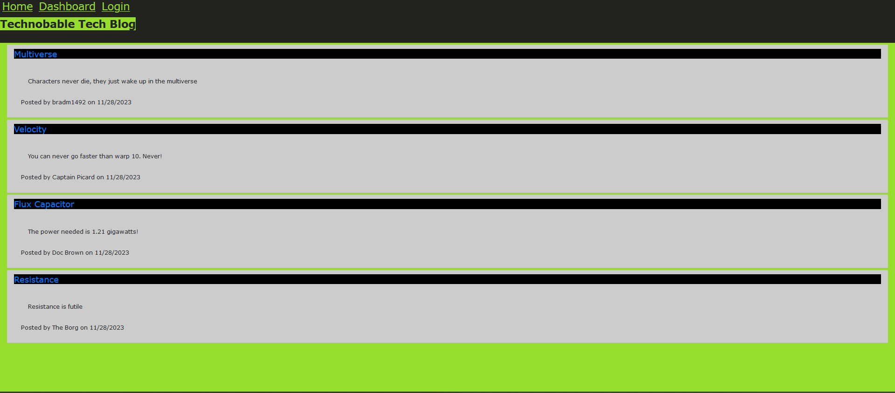   

If the user clicks on an existing blog post, they are presented with the post title, contents, post creator’s username, and date created for that post and have the option to leave a comment  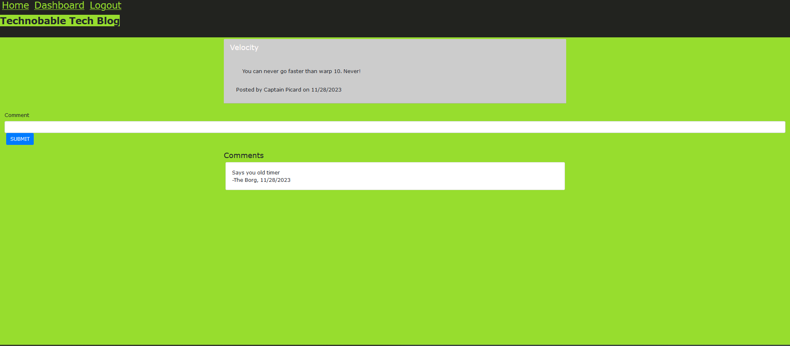  

If the user chooses to leave a comment, once the submit button has been clicked, the comment is saved, and the post is updated to display the comment, the comment creator’s username, and the date created.  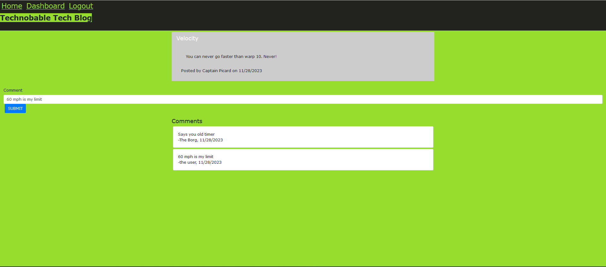   

If the user clicks on the dashboard option in the navigation, they taken to the dashboard and presented with any blog posts they have already created and the option to add a new blog post 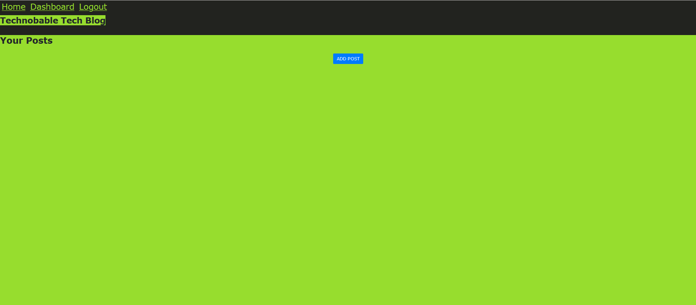  

If the user clicks on the button to add a new blog post, they are prompted to enter both a title and contents for the blog post  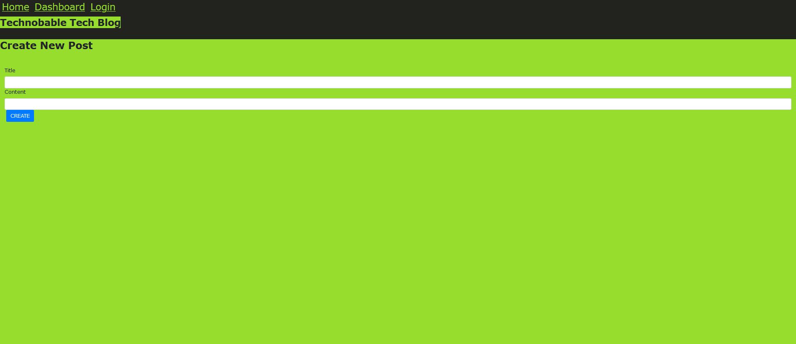  

If the user clicks on the button to create a new blog post, the title and contents of the post are saved and they are taken back to an updated dashboard with my new blog post  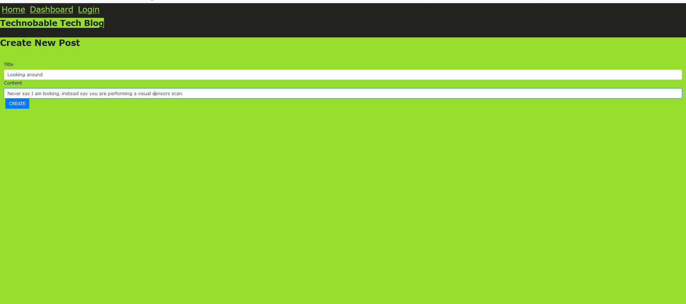  

If the user clicks on one of their existing posts in the dashboard they are able to delete or update they post and are taken back to an updated dashboard 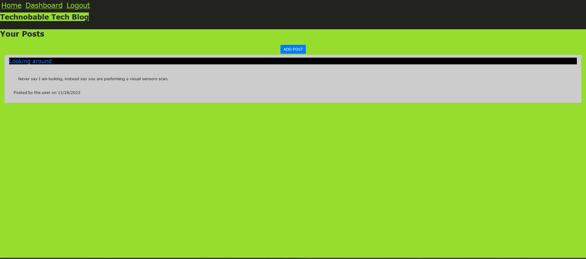    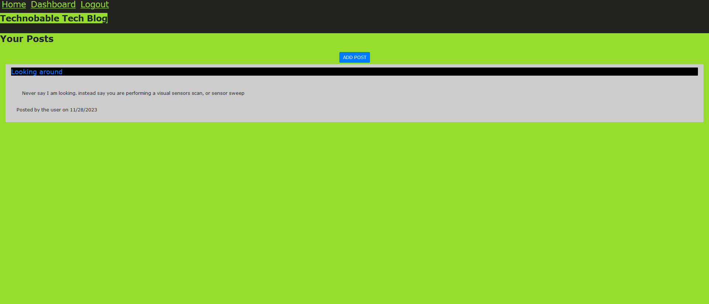  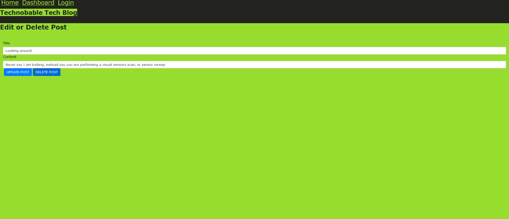     

The user will be logged out by choosing the log out option, or if they are idle for more than 5 minutes. 
## Licenses

MIT License

Copyright (c) 2023 Walter Moleterno

Permission is hereby granted, free of charge, to any person obtaining a copy
of this software and associated documentation files (the "Software"), to deal
in the Software without restriction, including without limitation the rights
to use, copy, modify, merge, publish, distribute, sublicense, and/or sell
copies of the Software, and to permit persons to whom the Software is
furnished to do so, subject to the following conditions:

The above copyright notice and this permission notice shall be included in all
copies or substantial portions of the Software.

THE SOFTWARE IS PROVIDED "AS IS", WITHOUT WARRANTY OF ANY KIND, EXPRESS OR
IMPLIED, INCLUDING BUT NOT LIMITED TO THE WARRANTIES OF MERCHANTABILITY,
FITNESS FOR A PARTICULAR PURPOSE AND NONINFRINGEMENT. IN NO EVENT SHALL THE
AUTHORS OR COPYRIGHT HOLDERS BE LIABLE FOR ANY CLAIM, DAMAGES OR OTHER
LIABILITY, WHETHER IN AN ACTION OF CONTRACT, TORT OR OTHERWISE, ARISING FROM,
OUT OF OR IN CONNECTION WITH THE SOFTWARE OR THE USE OR OTHER DEALINGS IN THE
SOFTWARE.
## Contributors
N/A
## Testing
N/A
## Features
It is literally posted on the web. Users can use it online frm all over the world. It uses Heroku. 
## Languages and Technologies Used

## Dependencies
Bcrypt version 5.0.1

connect-session-sequelize version 7.1.5 

Dotenv version 16.0.3

express  version 4.18.1, 

express-handlebars version 6.0.6, 

express-session version 1.17.3, 

handlebars version 4.7.7, 

mysql2 version 6.3.3, 

sequelize version 6.23.2 
## Questions
Please send your questions by email:  Bradm1492@gmail.com or visit [github/Boilermaker74](https://github.com/Boilermaker74).
